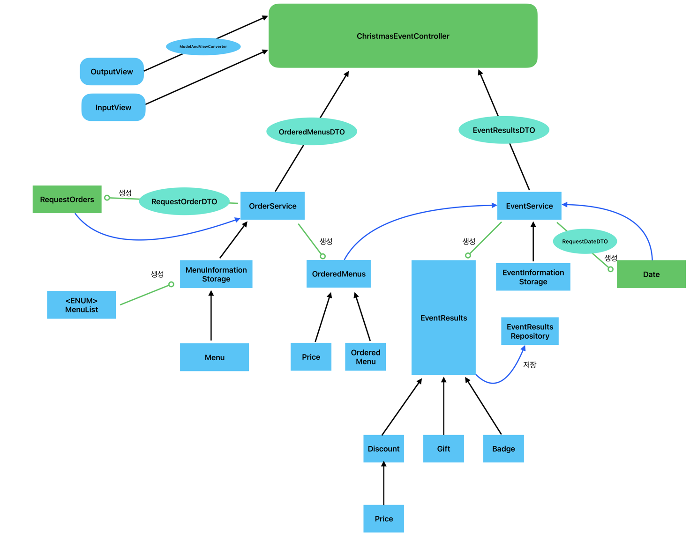

## 요구사항 간략화
1. 날짜 정보를 받는다.
2. 주문 메뉴와 수량 정보를 받는다.
3. 날짜 정보와 주문 메뉴를 통해 이벤트 내용을 확인한다.

# Class Diagram

# Model
### Date 관련
- [x] 날짜 정보 저장 - Date
- [x] 크리스마스 디데이 확인하기 - Date
- [x] 특별 할인 날인지 확인하기 - Date
- [x] 주말인지 확인하기 - Date
- [x] 특별 할인 날짜 저장 - SpecialDate (Enum)
- [x] 특별 할인 날인지 확인하기 - SpecialDate (Enum)

### Menu 관련
- [x] 각종 메뉴의 이름, 가격, 카테고리 보관 - Menu (Enum)
- [x] 특정 이름인지 확인 - Menu (Enum)
- [x] 특정 카테고리인지 확인 - Menu (Enum)
- [x] 특정 이름을 받아 동일한 이름의 메뉴 반환하기 - Menu (Enum)
- [x] 메뉴의 카테고리 보관 - MenuCategory (Enum)
- [x] 특정 카테고리인지 확인 - MenuCategory (Enum)

### Order 관련
- [x] 주문 메뉴 입력값 저장 - RequestOrder
- [x] 주문 메뉴에 대한 가격 계산해 반환 - RequestOrder
- [x] 주문이 특정 카테고리인지 반환 - RequestOrder
- [x] 주문 총 가격 저장 - Price
- [x] 주문을 통해 총 가격 업데이트 - Price
- [x] 주문 메뉴들 저장 - OrderedMenus
- [x] 카테고리별 주문 수량 반환 - OrderedMenus

### Event 관련
- [x] 배지 정보 저장 - Badge
- [x] 할인 금액을 통해 배지 등급 결정하기 - Badge
- [x] 증정 선물 정보 저장 - Gift
- [x] 총 주문 금액을 통해 증정선물 결정하기 - Gift
- [x] 선물 금액 반환하기 - Gift
- [x] 할인 금액 저장하기 - Discount (Abstract Class)
- [x] 할인 금액 업데이트 하기 - Discount (Abstract Class)
- [x] 할인 금액 계산하기(추상 메서드) - Discount (Abstract Class)
  - [x] 크리스마스 디데이 할인 - ChristmasDiscount
  - [x] 특별 할인 - SpecialDiscount
  - [x] 평일 할인 - WeekDiscount
  - [x] 주말 할인 - WeekendDiscount
- [x] 모든 할인 전략을 저장하고 리스트를 만들어 반환함 - DiscountStrategy  
- [x] 총 할인 금액 저장 - TotalDiscount
- [x] 모든 할인 전략을 적용 한다. - TotalDiscount
- [x] 모든 혜택 저장 및 업데이트 하기 - EventResults
- [ ] 혜택 정보 저장소에 저장하기 - EventResults
### DTO
- [x] 날짜 정보를 저장해 전달하기 위한 DTO - RequestDateDto
- [x] 주문 정보를 저장해 전달하기 위한 DTO - RequestOrdersDto
- [x] 주문 메뉴를 저장해 전달하기 위한 DTO - OrderedMenusDto
- [x] 혜택 결과를 저장해 전달하기 위한 DTO - EventResultsDto

### Util
- [x] 주문 메뉴 출력을 위해 데이터를 Dto 로 변환하기 - Converter
- [x] 혜택 결과 출력을 위해 데이터를 Dto 로 변환하기 - Converter
- [x] 날짜 입력값을 날짜 정보 데이터 Dto 로 변환하기 - Converter
- [x] 주문 입력값을 주문 정보 데이터 Dto 로 변환하기 - Converter
 
### Service
- [ ] 주문 정보 Dto 를 통해 주문 정보 객체 생성하기 - OrderService
- [ ] 주문 정보와 메뉴리스트를 사용해 주문 메뉴 객체 생성하기 - OrderService
- [ ] 날짜와 주문 메뉴, 이벤트 정보를 통해 결과 생성하기 - EventService
- [ ] 날짜 정보 Dto 를 통해 날짜 정보 객체 생성하기 - EventService

# Controller
- [ ] 날짜 정보를 converter 통해 Dto 로 받기 - ChristmasEventController
- [ ] 주문 정보를 converter 통해 Dto 로 받기 - ChristmasEventController
- [ ] 주문 메뉴 Dto 를 View 에 전달하기 - ChristmasEventController
- [ ] 혜택 결과 Dto 를 View 에 전달하기 - ChristmasEventController

