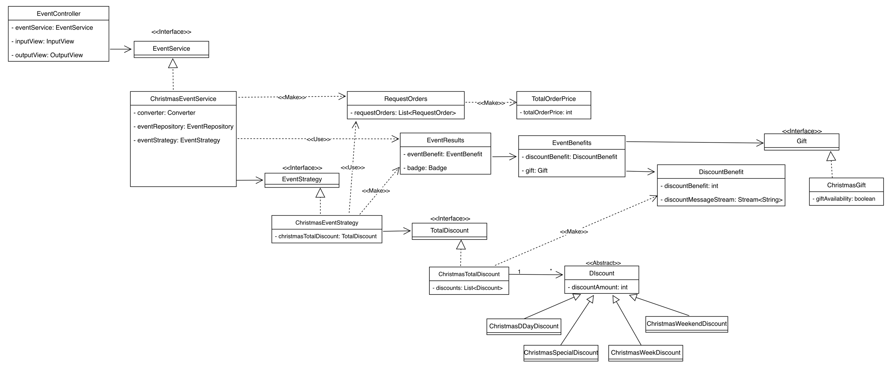

## 요구사항 간략화
1. 날짜 정보를 받는다.
2. 주문 메뉴와 수량 정보를 받는다.
3. 날짜 정보와 주문 메뉴를 통해 이벤트 내용을 확인한다.

# Class Diagram

# Model
### Date 관련
- **날짜 정보 저장 - Date**
  - [x] 크리스마스 디데이 확인하기
  - [x] 특별 할인 날인지 확인하기
  - [x] 주말인지 확인하기
  - [x] DTO 생성
- **특별 할인 날짜 저장 - SpecialDate (Enum)**
  - [x] 특별 할인 날인지 확인하기 

### Menu 관련
- **각종 메뉴의 이름, 가격, 카테고리 보관 - Menu (Enum)**
  - [x] 특정 이름인지 확인
  - [x] 특정 카테고리인지 확인
  - [x] 특정 이름을 받아 동일한 이름의 메뉴 반환하기
  - [x] 이름 반환하기
- **메뉴의 카테고리 보관 - MenuCategory (Enum)**
  - [x] 특정 카테고리인지 확인

### Order 관련
- **주문 메뉴 입력값 저장 - RequestOrder**
  - [x] 주문 메뉴에 대한 가격 계산해 반환
  - [x] 주문이 특정 카테고리인지 반환
  - [x] 출력 메시지 생성해 반환하기
- **주문 총 가격 저장 - Price**
  - [x] 주문을 통해 총 가격 업데이트
  - [x] 주문 금액에 의해 선물을 반환하는 기능
- **주문 메뉴들 저장 - OrderedMenus**
  - [x] 주문 리스트를 받아 생성하며, 생성시 총 가격 업데이트 진행 
  - [x] 카테고리별 주문 수량 반환
  - [x] Price 에서 만든 Gift 반환
  - [x] 총 주문 금액 반환 
  - [ ] 주문한 메뉴의 총 수량 반환
### Event 관련
- **배지 정보 저장 - Badge**
  - [x] 출력 메시지 위해 배지 이름 추가 및 toString 오버라이딩
  - [x] 할인 금액을 통해 배지 등급 결정하기
- **증정 선물 정보 저장 - Gift**
  - [x] 총 주문 금액을 통해 증정선물 결정하기
  - [x] 금액에 따라 선물 여부 결정해 메시지 출력 기능 구현
  - [x] 선물 금액 반환하기
- **할인 금액 저장하기 - Discount (Abstract Class)**
  - [x] 할인 금액 업데이트 하기
  - [x] 할인 금액 계산하기(추상 메서드)
    - [x] 크리스마스 디데이 할인 - ChristmasDiscount
    - [x] 특별 할인 - SpecialDiscount
    - [x] 평일 할인 - WeekDiscount
    - [x] 주말 할인 - WeekendDiscount
  - [x] 각 Discount 에 출력 메시지 생성 기능 구현 - 모든 Discount
  - [x] 각 Discount 의 금액이 0원이 아닌지 확인하는 기능 구현
  - [x] 각 Discount 를 리셋하기
- [x] 모든 할인 전략을 저장하고 리스트를 만들어 반환함 - DiscountStrategy  
- **총 할인 금액 저장 - TotalDiscount**
  - [x] 모든 할인 전략을 적용 하기
  - [x] 0원 이상의 모든 할인 전략 출력 메시지 만들기
- **모든 혜택 저장 및 업데이트 하기 - EventResults**
  - [x] 혜택 업데이트 하기 - EventResults
  - [ ] 혜택 정보 저장소에 저장하기 - EventResults
### DTO
- [x] 날짜 정보를 저장해 전달하기 위한 DTO - RequestDateDto
- [x] 주문 정보를 저장해 전달하기 위한 DTO - RequestOrdersDto
- [x] 날짜 정보를 저장해 view 로 전달하기 위한 DTO - RespondDateDto
- **주문 메뉴를 저장해 전달하기 위한 DTO - OrderedMenusDto**
  - [x] 메뉴 출력 메시지 생성해 반환
  - [x] 주문 금액 반환
- **혜택 결과를 저장해 전달하기 위한 DTO - EventResultsDto**
  - [x] 할인 메시지를 스트림으로 반환하기
  - [x] 증정 상품 메시지 생성해 반환하기

### Util
- **domain <-> DTO 변환 기능 - Converter**
  - [x] 주문 메뉴 출력을 위해 데이터를 Dto 로 변환하기
  - [x] 혜택 결과 출력을 위해 데이터를 Dto 로 변환하기
  - [x] 날짜 입력값을 날짜 정보 데이터 Dto 로 변환하기
  - [x] 주문 입력값을 주문 정보 데이터 Dto 로 변환하기
  - [x] 주문 메뉴의 DTO 를 주문 메뉴 객체로 변환하기
 
### Service
- [x] 요청 주문 Dto 를 통해 주문 정보 객체 생성하기 - OrderService
- [x] 요청 주문 정보 사용해 주문한 메뉴들의 DTO 생성하기 - OrderService
- [x] 날짜와 주문한 메뉴들을 통해 이벤트 결과 생성하기 - EventService
  - [x] 총 주문 금액이 최소금액보다 작으면 이벤트 실행 X - EventService
- [x] 날짜 정보 Dto 를 통해 날짜 정보 객체 생성하기 - EventService

# Controller
- [ ] 날짜 정보를 converter 통해 Dto 로 받기 - ChristmasEventController
- [ ] 주문 정보를 converter 통해 Dto 로 받기 - ChristmasEventController
- [ ] 주문 메뉴 Dto 를 View 에 전달하기 - ChristmasEventController
- [ ] 혜택 결과 Dto 를 View 에 전달하기 - ChristmasEventController

